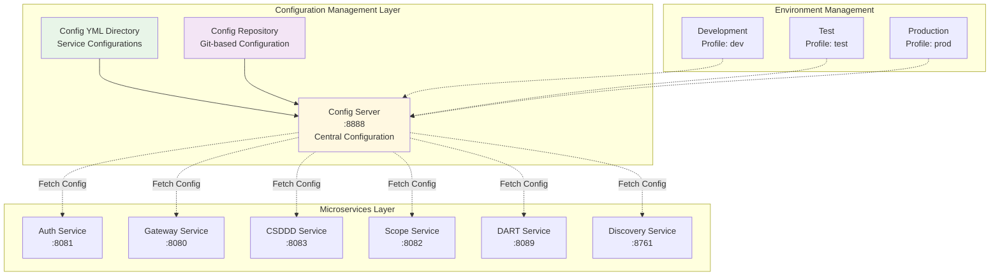
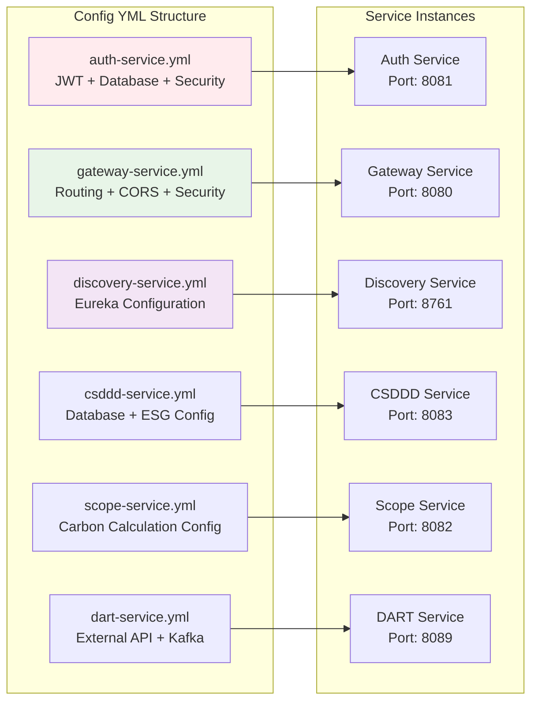
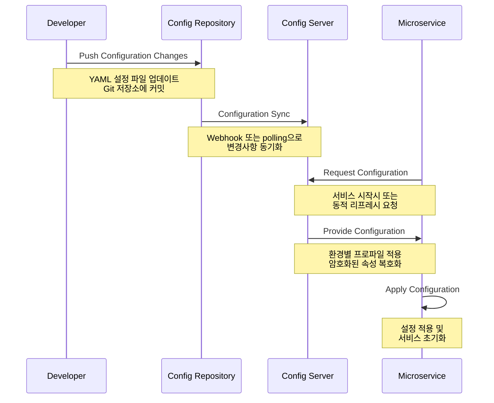
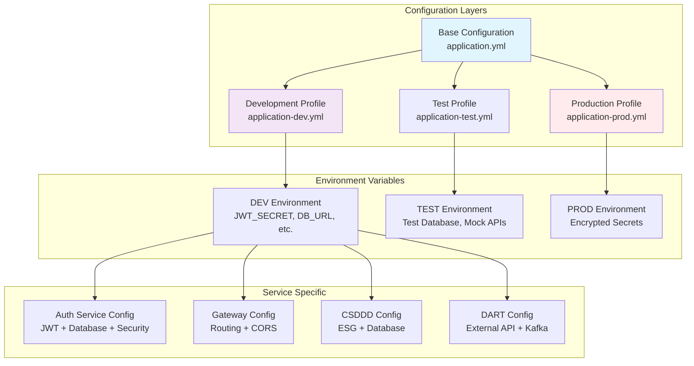
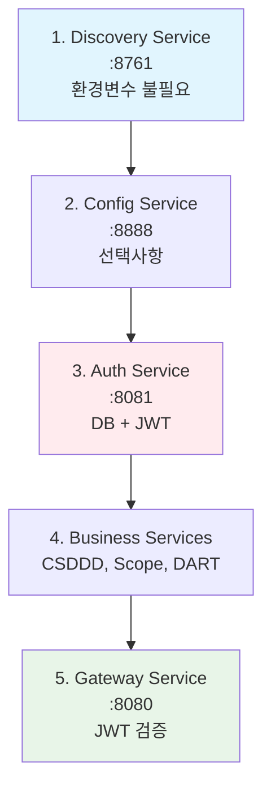

# Spring Cloud Config Management - 중앙집중식 설정 관리

**포트폴리오 프로젝트**: ESG 플랫폼 - 마이크로서비스 중앙집중식 구성 관리 시스템

## 프로젝트 개요

Config YML 디렉토리는 ESG 플랫폼의 **분산 설정 관리 시스템**으로, Spring Cloud Config와 연동하여 **마이크로서비스 전체의 구성을 중앙에서 통합 관리**합니다. 각 서비스별 환경변수, 데이터베이스 설정, 보안 정책을 표준화하여 **개발/테스트/운영 환경 간의 일관성**을 보장합니다.

### 핵심 기능

- **중앙집중식 설정**: 모든 마이크로서비스의 구성을 단일 저장소에서 관리
- **환경별 프로파일**: 개발/테스트/운영 환경별 독립적인 설정 관리
- **동적 설정 리프레시**: 서비스 재시작 없이 실시간 구성 변경 적용
- **설정 표준화**: 일관된 네이밍 규칙과 구조를 통한 관리 효율성 향상
- **보안 설정 중앙화**: JWT, 데이터베이스, 외부 API 키 등 보안 정책 통합 관리

### 기술 스택


[](https://spring.io/projects/spring-cloud-config)
[](https://yaml.org/)
[](https://docs.spring.io/spring-boot/docs/current/reference/html/features.html#features.profiles)
[](https://spring.io/projects/spring-cloud-netflix)

## 시스템 아키텍처

### 중앙집중식 설정 관리 구조



### 설정 파일 구조와 서비스 매핑



## 설정 아키텍처 및 표준화

### 구성 관리 플로우



### 환경별 설정 전략



## 서비스별 구성 상세

### Auth Service 구성 (포트: 8081)

**역할**: JWT 기반 인증, 계층적 권한 관리, 본사/협력사 사용자 관리

#### 핵심 설정 영역

| 설정 영역 | 구성 요소 | 설명 |
|----------|----------|------|
| **Database** | HikariCP Pool | 최대 15개 연결, 5개 최소 유지 |
| **JWT Security** | Token Management | 24시간 토큰, HttpOnly 쿠키 |
| **JPA/Hibernate** | ORM Configuration | MySQL 방언, 배치 처리 최적화 |
| **Eureka Client** | Service Discovery | 30초 하트비트, IP 우선 사용 |
| **Monitoring** | Actuator | Health, Metrics, Environment |

#### 환경변수 매핑

```yaml
# 필수 환경변수
DB_URL: jdbc:mysql://localhost:3306/esg_auth
DB_USERNAME: esg_user
DB_PASSWORD: esg_password
JWT_SECRET: [256비트 이상 보안키]

# 선택적 환경변수  
JPA_DDL_AUTO: update | create | validate | none
JPA_SHOW_SQL: true (개발) | false (운영)
JWT_COOKIE_SECURE: false (개발) | true (운영)
EUREKA_SERVER: http://localhost:8761/eureka/
```

### Gateway Service 구성 (포트: 8080)

**역할**: API Gateway, 라우팅, JWT 검증, CORS 관리

#### 핵심 설정 영역

| 설정 영역 | 구성 요소 | 설명 |
|----------|----------|------|
| **Routing** | Spring Cloud Gateway | 서비스별 경로 매핑 및 로드밸런싱 |
| **Security** | JWT Filter | 토큰 검증 및 헤더 변환 |
| **CORS** | Global Configuration | 클라이언트 요청 정책 관리 |
| **Load Balancing** | Eureka Integration | 동적 서비스 발견 및 분산 |

#### 라우팅 규칙

```yaml
# 주요 라우팅 설정
Auth Service: /api/v1/auth/** → lb://auth-service
CSDDD Service: /api/v1/csddd/** → lb://csddd-service  
Scope Service: /api/v1/scope/** → lb://scope-service
DART Service: /api/v1/dart/** → lb://dart-service

# JWT 검증 제외 경로
- /api/v1/auth/headquarters/login
- /api/v1/auth/headquarters/register
- /api/v1/auth/partners/login
```

### Discovery Service 구성 (포트: 8761)

**역할**: Netflix Eureka 기반 서비스 레지스트리 및 디스커버리

#### 핵심 설정 영역

| 설정 영역 | 구성 요소 | 설명 |
|----------|----------|------|
| **Eureka Server** | Service Registry | 서비스 등록 및 상태 관리 |
| **Self Registration** | Server Configuration | 자기 등록 비활성화 |
| **Logging** | Netflix Components | Eureka, Discovery 로그 레벨 |

```yaml
# 환경변수 불필요 (기본 설정 사용)
# 선택적 로그 레벨 제어
EUREKA_LOG_LEVEL: INFO | DEBUG
DISCOVERY_LOG_LEVEL: INFO | DEBUG
NETFLIX_LOG_LEVEL: INFO | DEBUG
```

### CSDDD Service 구성 (포트: 8083)

**역할**: CSDDD 규정 준수 데이터 관리, ESG 리포팅

#### 핵심 설정 영역

| 설정 영역 | 구성 요소 | 설명 |
|----------|----------|------|
| **Database** | MySQL Integration | Auth Service와 동일 DB 공유 |
| **JPA Optimization** | Batch Processing | 대용량 ESG 데이터 처리 최적화 |
| **Performance** | Connection Pool | 최적화된 커넥션 관리 |
| **Monitoring** | Health Checks | 실시간 서비스 상태 추적 |

### Scope Service 구성 (포트: 8082)

**역할**: GHG Protocol Scope 1/2/3 탄소배출량 계산 및 관리

#### 핵심 설정 영역

| 설정 영역 | 구성 요소 | 설명 |
|----------|----------|------|
| **Database** | Dedicated Schema | esg_scope 전용 데이터베이스 |
| **JWT Integration** | Security | 15분 토큰, 엄격한 보안 정책 |
| **Carbon Calculations** | Precision Math | BigDecimal 기반 정확한 계산 |

### DART Service 구성 (포트: 8089)

**역할**: 금융감독원 DART API 연동, 기업 공시정보 수집

#### 핵심 설정 영역

| 설정 영역 | 구성 요소 | 설명 |
|----------|----------|------|
| **External API** | DART Integration | 금융감독원 공시 데이터 수집 |
| **Message Queue** | Kafka | 대용량 데이터 스트리밍 처리 |
| **Rate Limiting** | Resilience4j | API 호출 제한 및 안정성 |
| **Caching** | Multi-level Cache | 기업정보, 공시검색, 법인코드 캐시 |

#### 환경변수 매핑

```yaml
# 필수 환경변수
DB_URL: jdbc:mysql://localhost:3306/esg_dart
DB_USER: esg_user  # DART 서비스 전용 변수명
DB_PASS: esg_password  # DART 서비스 전용 변수명
DART_API_KEY: [DART 공식 API 키]
KAFKA_BOOTSTRAP_SERVERS: localhost:9093

# API 제한 설정
Rate Limiting: 10 requests/second
Cache TTL: 1시간 (기업정보), 24시간 (법인코드)
```

## 통합 환경 설정 가이드

### 개발 환경 Quick Start

#### 1단계: 최소 환경변수 설정

```bash
# 공통 데이터베이스 (Auth + CSDDD + Scope)
export DB_URL=jdbc:mysql://localhost:3306/esg_auth
export DB_USERNAME=esg_user
export DB_PASSWORD=esg_password

# DART Service 전용 데이터베이스
export DB_USER=esg_user
export DB_PASS=esg_password

# 보안 설정 (Auth + Gateway 공통)
export JWT_SECRET=dev-secret-key-256-bits-minimum

# 외부 API 통합
export DART_API_KEY=your-dart-api-key-from-opendart
export KAFKA_BOOTSTRAP_SERVERS=localhost:9093

# 개발 편의 설정
export JPA_SHOW_SQL=true
export JWT_COOKIE_SECURE=false
export JPA_DDL_AUTO=update
```

#### 2단계: 서비스 의존성 순서 실행



#### 3단계: 서비스 실행 스크립트

```bash
#!/bin/bash
# ESG 플랫폼 개발환경 실행 스크립트

echo "Starting ESG Platform Services..."

# Discovery Service (최우선 실행)
cd backend/discovery-service
./gradlew bootRun > logs/discovery.log 2>&1 &
echo "Discovery Service started on :8761"

sleep 10

# Auth Service (인증 기반 서비스)
cd ../auth-service  
./gradlew bootRun > logs/auth.log 2>&1 &
echo "Auth Service started on :8081"

# Business Services (병렬 실행)
cd ../csddd-service
./gradlew bootRun > logs/csddd.log 2>&1 &
echo "CSDDD Service started on :8083"

cd ../scope-service
./gradlew bootRun > logs/scope.log 2>&1 &
echo "Scope Service started on :8082"

cd ../dart-service
./gradlew bootRun > logs/dart.log 2>&1 &
echo "DART Service started on :8089"

sleep 5

# Gateway Service (마지막 실행)
cd ../gateway-service
./gradlew bootRun > logs/gateway.log 2>&1 &
echo "Gateway Service started on :8080"

echo "All services started successfully!"
```

### 설정 검증 및 모니터링

#### 서비스 상태 확인

```bash
# 전체 서비스 상태 체크 스크립트
#!/bin/bash

services=(
    "Discovery:8761:/actuator/health"
    "Auth:8081:/actuator/health"
    "Gateway:8080:/actuator/health"
    "CSDDD:8083:/actuator/health"
    "Scope:8082:/actuator/health"
    "DART:8089:/api/v1/actuator/health"
)

for service in "${services[@]}"; do
    IFS=':' read -r name port path <<< "$service"
    echo -n "Checking $name Service... "
    
    if curl -s "http://localhost:$port$path" > /dev/null; then
        echo "✅ Running"
    else
        echo "❌ Failed"
    fi
done

# Eureka 등록 확인
echo "📋 Registered Services:"
curl -s http://localhost:8761/eureka/apps | grep -o '<name>[^<]*</name>' | sed 's/<[^>]*>//g'
```

#### 환경변수 검증

```bash
# 환경변수 검증 스크립트
#!/bin/bash

required_vars=(
    "DB_URL"
    "DB_USERNAME" 
    "DB_PASSWORD"
    "JWT_SECRET"
    "DART_API_KEY"
)

echo "=== 필수 환경변수 검증 ==="

for var in "${required_vars[@]}"; do
    if [ -n "${!var}" ]; then
        echo "✅ $var: Set"
    else
        echo "❌ $var: Missing"
    fi
done

echo ""
echo "=== JWT Secret 길이 검증 ==="
if [ ${#JWT_SECRET} -ge 32 ]; then
    echo "✅ JWT_SECRET: Sufficient length (${#JWT_SECRET} characters)"
else
    echo "⚠️  JWT_SECRET: Too short (${#JWT_SECRET} characters, minimum 32)"
fi
```

## 환경별 최적화 설정

### 개발 환경 (Development)

```yaml
# 개발 최적화 설정
spring:
  profiles:
    active: dev
    
# 성능보다 디버깅 우선
jpa:
  show-sql: true
  hibernate:
    ddl-auto: update
    
# 보안 완화 (개발 편의)
jwt:
  cookie:
    secure: false
    
# 로깅 상세화
logging:
  level:
    com.nsmm.esg: DEBUG
    org.hibernate.SQL: DEBUG
```

### 테스트 환경 (Test)

```yaml
# 테스트 최적화 설정
spring:
  profiles:
    active: test
    
# 테스트 데이터베이스
datasource:
  url: jdbc:h2:mem:testdb
  
# 스키마 자동 생성
jpa:
  hibernate:
    ddl-auto: create-drop
    
# Mock 외부 API
dart:
  api:
    enabled: false
```

### 운영 환경 (Production)

```yaml
# 운영 최적화 설정
spring:
  profiles:
    active: prod
    
# 성능 우선
jpa:
  show-sql: false
  hibernate:
    ddl-auto: validate
    
# 보안 강화
jwt:
  cookie:
    secure: true
    same-site: strict
    
# 최소 로깅
logging:
  level:
    root: WARN
    com.nsmm.esg: INFO
```

## 보안 및 모범 사례

### 환경변수 보안 관리

#### Vault 통합 (권장)

```yaml
# Spring Cloud Vault 설정
spring:
  cloud:
    vault:
      uri: https://vault.company.com
      authentication: KUBERNETES
      kv:
        enabled: true
        backend: secret
        
# 암호화된 속성 예시
database:
  password: '{cipher}encrypted-password-value'
jwt:
  secret: '{cipher}encrypted-jwt-secret'
```

#### 로컬 개발 보안

```bash
# .env 파일 생성 (git ignore 필수)
echo ".env" >> .gitignore
echo ".env.*" >> .gitignore

# 개발자별 로컬 환경변수
cp .env.template .env.local
# .env.local 파일에 개인 설정 추가
```

### 구성 관리 모범 사례

#### 1. 설정 계층화

```
application.yml           # 기본 설정
application-dev.yml       # 개발환경 오버라이드  
application-test.yml      # 테스트환경 오버라이드
application-prod.yml      # 운영환경 오버라이드
```

#### 2. 민감 정보 분리

```yaml
# 공개 가능한 설정
server:
  port: 8081
  
spring:
  application:
    name: auth-service
    
# 환경변수로 분리할 민감 정보
# - 데이터베이스 연결 정보
# - API 키 및 시크릿
# - 암호화 키
```

#### 3. 환경별 검증

```bash
# 설정 검증 테스트
./gradlew test -Dspring.profiles.active=test
./gradlew integrationTest -Dspring.profiles.active=integration
```

## 주요 특징

- **표준화**: 모든 서비스에 일관된 설정 구조 적용
- **확장성**: 새로운 서비스 추가시 템플릿 기반 빠른 설정
- **보안성**: 환경변수 기반 민감 정보 분리 관리
- **모니터링**: Actuator 기반 실시간 설정 상태 추적
- **자동화**: 스크립트 기반 환경 구성 및 검증

---

**기술적 성과**:
- Spring Cloud Config 기반 중앙집중식 구성 관리 시스템 설계
- 6개 마이크로서비스의 일관된 설정 표준화 및 템플릿화
- 환경별 프로파일 전략과 보안 정책 통합 관리
- 개발/테스트/운영 환경 간 설정 자동화 및 검증 시스템 구축

